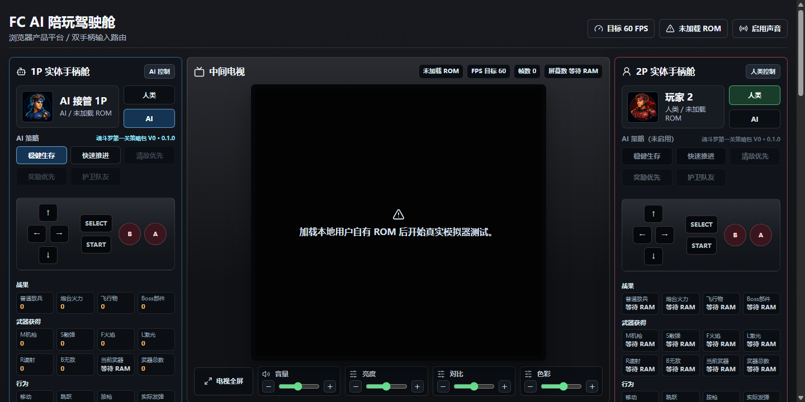
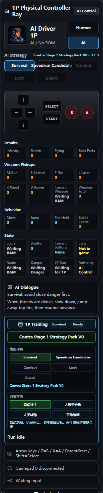
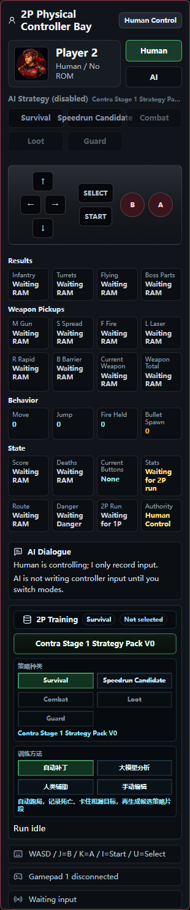

# FC AI Companion / FC AI 伴侣

First public release line: `v0.1.x`
首个公开发布线：`v0.1.x`

FC AI Companion is a browser-based AI companion cockpit for NES/FC games.

FC AI 伴侣是一个面向 NES/FC 游戏的浏览器 AI 陪玩驾驶舱。

The goal is not to build an auto-clear bot. The goal is to make the player feel that they are playing together with an AI teammate.

本项目目标不是制作自动通关机器人，而是让玩家感觉自己正在和一个 AI 队友一起玩。

## Interface Preview / 界面预览

The screenshot shows the full browser cockpit version, not the separate viewing/studio prototype.

截图展示的是完整浏览器驾驶舱版本，不是单独的观赏版或 studio 原型。



English pilot panels / 英文角色侧栏：




中文角色侧栏：


Feature detail views / 功能细节视图：


## Quick Start / 快速开始

Requirements / 环境要求：

- Node.js 22 or newer / Node.js 22 或更新版本
- npm / npm
- A legally owned local NES/FC ROM file for runtime testing / 用于本地运行测试的合法自有 NES/FC ROM 文件

Install dependencies / 安装依赖：

```powershell
npm ci
```

Run the browser cockpit / 运行浏览器驾驶舱：

```powershell
npm run dev:cockpit
```

Open / 打开：

```text
http://localhost:5173/
```

Windows ROM path example / Windows ROM 路径示例：

```powershell
$env:FC_ROM_PATH="D:\your-rom-folder\contra.nes"
npm run dev:cockpit
```

macOS/Linux ROM path example / macOS/Linux ROM 路径示例：

```bash
FC_ROM_PATH="/your-rom-folder/contra.nes" npm run dev:cockpit
```

Verify the project / 验证项目：

```powershell
npm test
npm run build
```

## Product Principles / 产品原则

- Player experience is more important than AI strength. / 玩家体验比 AI 强度更重要。
- Companion play is more important than stage clear. / 陪玩感比通关结果更重要。
- The fast brain must be RAM-driven and frame-synchronous. / 快脑必须由 RAM 状态驱动，并与帧同步。
- The slow brain must be event-driven and must never block gameplay. / 慢脑必须由事件驱动，且不能阻塞游戏运行。
- Training is promoted only after the rule/FSM baseline is stable. / 规则和 FSM 基线稳定后，训练结果才进入发布归纳。

## Current Runtime Scope / 当前运行范围

The AI already has basic action control:

当前 AI 已具备基础动作控制：

- Run left/right / 左右移动
- Jump / 跳跃
- Shoot / 射击
- Lie down / 趴下
- Directional aiming / 方向瞄准
- Combined actions / 组合动作

The current challenge is not button output ability, but tactical quality.

当前挑战不是按键输出能力，而是战术质量。

The runtime is organized around:

运行时围绕以下模块组织：

- Danger Detector / 危险检测
- Route Script / 路线脚本
- Action Lock / 动作锁
- FSM / 有限状态机
- RAM Clock / RAM 时钟

## v0.1.0 Public Test / v0.1.0 公开测试

- Platform: NES/FC / 平台：NES/FC
- Game target: Contra 1, Stage 1 / 游戏目标：《魂斗罗》1 第一关
- Mode: two-player companion cockpit / 模式：双人陪玩驾驶舱
- Runtime: browser product platform / 运行时：浏览器产品平台
- Strategy package: current Contra Stage 1 candidate pack / 策略包：当前《魂斗罗》第一关候选策略包

This is the first public test version. Requirements grew gradually during the development process, so the system is currently broad and relatively complex. Later versions should simplify workflows, modularize the architecture, and improve the user experience.

这是第一版公开测试版本。需求是在开发过程中逐步成长出来的，因此当前系统功能较多、复杂度也较高。后续版本应继续简化流程、模块化结构并优化用户体验。

## Strategy Pack / 策略包

The trained strategy data included in this first public release is located at:

本次首个公开版本归纳发布的训练策略数据位于：

```text
strategy-packs/contra/
apps/browser-cockpit/public/strategies/contra/stage1/
```

The strategy pack is released as a candidate package. It includes current training evidence and runtime route exports, but it is not claimed as a fully validated no-death clear package.

该策略包以候选策略包形式发布，包含当前训练证据和运行时路线导出，但不声明为已经完整验证的无死亡通关包。

## Project Background / 项目背景

This project was started by a 50+ lifelong learner with no traditional technical background. AI made it possible to build and test an idea that would otherwise have been out of reach.

本项目由一位 50+ 的终身学习者发起。发起者没有传统技术背景，但在 AI 赋能后，可以开始做自己真正感兴趣的事情。

Everyone here is a learner. Communication should be respectful, practical, and focused on learning and improving together.

大家都是学习者。沟通应保持尊重、务实，并聚焦于共同学习和共同进步。

## Repository Policy / 仓库政策

This is the clean public repository for the project. Historical test packages and local ROM folders are reference-only and should not be used as the active development location.

这是项目的正式干净仓库。历史测试包和本地 ROM 文件夹只作为参考，不应在原地继续开发。

Do not commit ROMs, BIOS files, save states, save files, or copyrighted commercial game assets.

不得提交 ROM、BIOS、即时存档、存档文件或受版权保护的商业游戏资产。

This repository is currently published as source-available. Read `LICENSE` before copying, modifying, or redistributing.

本仓库当前以 source-available 方式公开。复制、修改或再分发前请先阅读 `LICENSE`。

Public release notes and checklist / 公开发布说明和检查清单：

- `docs/RELEASE_NOTES_v0.1.0.md`
- `docs/PUBLIC_RELEASE_CHECKLIST.md`
- `docs/PROJECT_BACKGROUND.md`
- `docs/DEVELOPMENT_PROCESS.md`
- `docs/06_ROM_POLICY.md`
