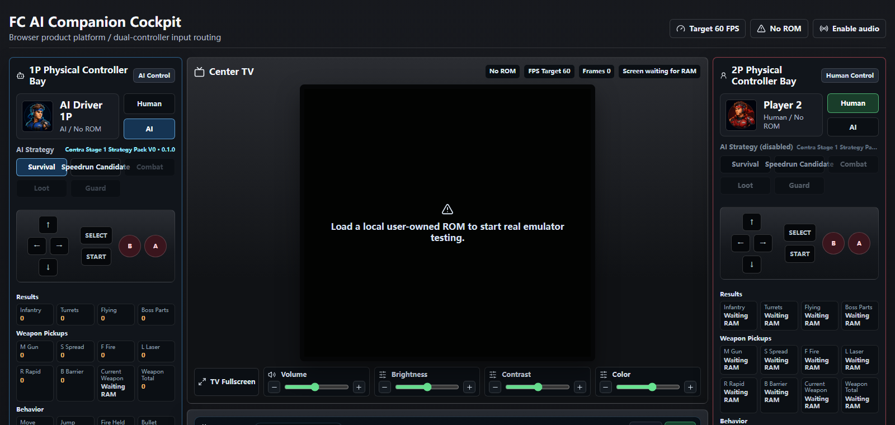
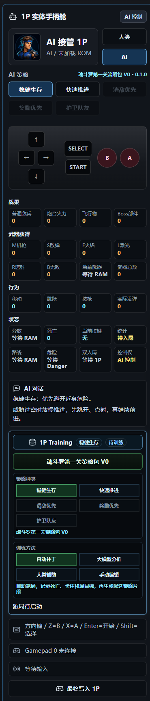
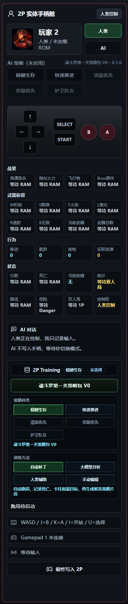
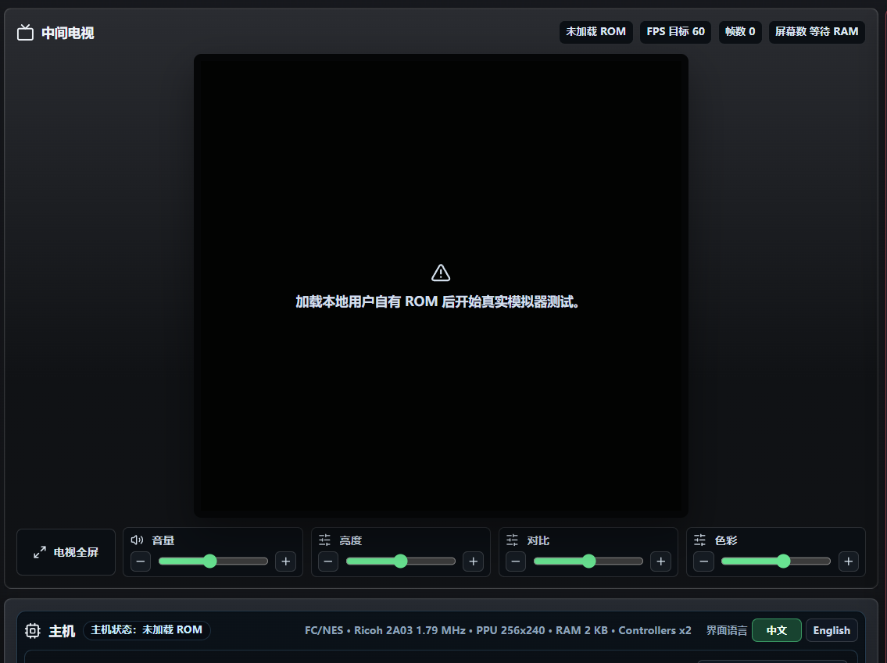
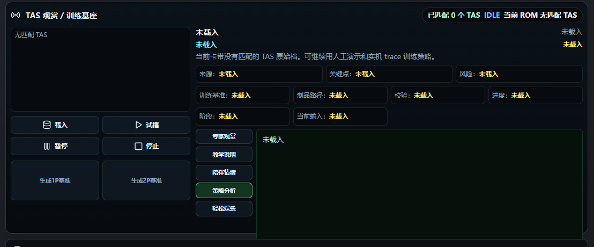
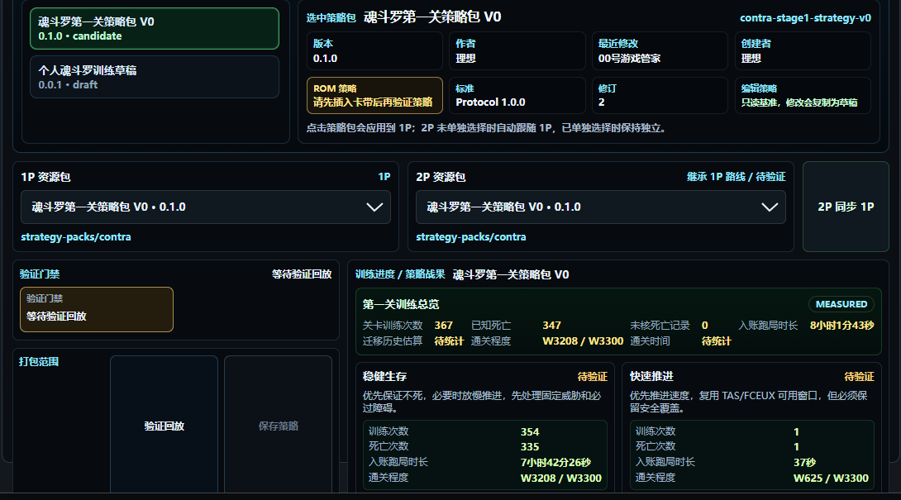
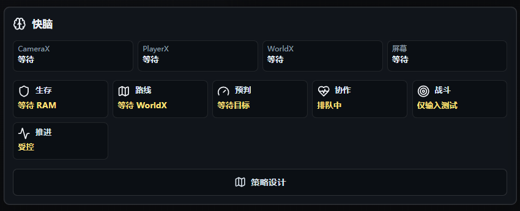
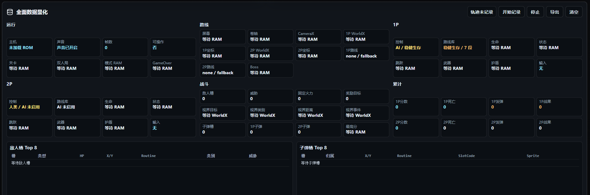

# FC AI 伴侣

[English](README.md) | [中文](README.zh-CN.md)

首个公开发布线：`v0.1.x`

FC AI 伴侣是一个面向 NES/FC 游戏的浏览器 AI 陪玩驾驶舱。

本项目目标不是制作自动通关机器人，而是让玩家感觉自己正在和一个 AI 队友一起玩。

## 界面预览

截图展示的是浏览器驾驶舱版本，不是单独的观赏版或 studio 原型。截图处于公开安全的 No ROM 状态，不包含 ROM 文件或商业游戏画面。



中文角色侧栏：

<table>
  <tr>
    <td></td>
    <td></td>
  </tr>
</table>

功能细节视图：











## 快速开始

环境要求：

- Node.js 22 或更新版本
- npm
- 用于本地运行测试的合法自有 NES/FC ROM 文件

安装依赖：

```powershell
npm ci
```

运行浏览器驾驶舱：

```powershell
npm run dev:cockpit
```

打开：

```text
http://localhost:5173/
```

Windows ROM 路径示例：

```powershell
$env:FC_AI_COMPANION_ROM_PATH="D:\your-rom-folder\your-game.nes"
npm run dev:cockpit
```

macOS/Linux ROM 路径示例：

```bash
FC_AI_COMPANION_ROM_PATH="/your-rom-folder/your-game.nes" npm run dev:cockpit
```

验证项目：

```powershell
npm test
npm run build
```

## 产品原则

- 玩家体验比 AI 强度更重要。
- 陪玩感比通关结果更重要。
- 快脑必须由 RAM 状态驱动，并与帧同步。
- 慢脑必须由事件驱动，且不能阻塞游戏运行。
- 规则和 FSM 基线稳定后，训练结果才进入发布归纳。

## 当前运行范围

当前 AI 已具备基础动作控制：

- 左右移动
- 跳跃
- 射击
- 趴下
- 方向瞄准
- 组合动作

当前挑战不是按键输出能力，而是战术质量。

运行时围绕以下模块组织：

- 危险检测
- 路线脚本
- 动作锁
- 有限状态机
- RAM 时钟

## v0.1.0 公开测试

- 平台：NES/FC
- 游戏目标：《魂斗罗》1 第一关
- 模式：双人陪玩驾驶舱
- 运行时：浏览器产品平台
- 策略包：当前《魂斗罗》第一关候选策略包

这是第一版公开测试版本。需求是在开发过程中逐步成长出来的，因此当前系统功能较多、复杂度也较高。后续版本应继续简化流程、模块化结构并优化用户体验。

## 策略包

本次首个公开版本归纳发布的训练策略数据位于：

```text
strategy-packs/contra/
apps/browser-cockpit/public/strategies/contra/stage1/
```

该策略包以候选策略包形式发布，包含当前训练证据和运行时路线导出，但不声明为已经完整验证的无死亡通关包。

## 项目背景

本项目由一位 50+ 的终身学习者发起。发起者没有传统技术背景，但在 AI 赋能后，可以开始做自己真正感兴趣的事情。

大家都是学习者。沟通应保持尊重、务实，并聚焦于共同学习和共同进步。

## 仓库政策

这是项目的正式干净仓库。历史测试包和本地 ROM 文件夹只作为参考，不应在原地继续开发。

不得提交 ROM、BIOS、即时存档、存档文件或受版权保护的商业游戏资产。

本仓库当前以 source-available 方式公开。复制、修改或再分发前请先阅读 `LICENSE`。

公开发布说明和检查清单：

- `docs/RELEASE_NOTES_v0.1.0.md`
- `docs/PUBLIC_RELEASE_CHECKLIST.md`
- `docs/PROJECT_BACKGROUND.md`
- `docs/DEVELOPMENT_PROCESS.md`
- `docs/06_ROM_POLICY.md`
